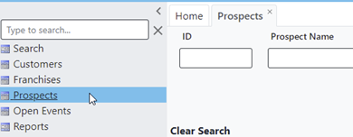

# Dealing with disconnected prospects

During the course of calling, a Sales rep may indicate that the prospect they just called, had a disconnected number. They indicate this by selecting ‘Number Disconnected’ in the Call Outcome list.

When the Sales rep selects this Outcome, the Prospect will be ‘flagged’ for verification.

In order to look at these prospects, go into the Prospects screen, and select ‘Yes’ under Verify

This will populate the list of prospects that need verification. You may now open each prospect, Verify the ‘Disconnected’ status by calling or searching for the correct Phone number, and, if necessary, select DNC with the reason of Disconnected.

Don’t forget to Uncheck ‘Verification Needed’ before Saving!

Permissions | Last Updated
--- | ---
{{ permissions }} | {{ git.date.strftime("%b %d, %Y %I:%M:%S %p") }}
